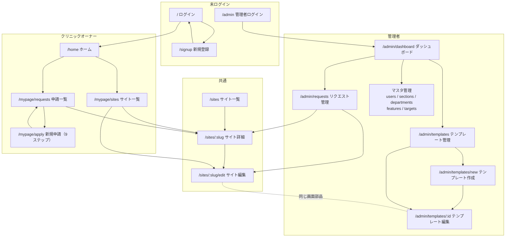
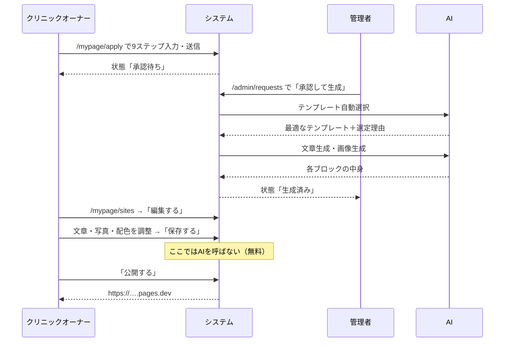

# Clinc-HP 画面設計書

**対象システム**：Clinc-HP（AIクリニックホームページ自動生成・編集システム）
**最終更新**：2026-08-20
**関連文書**：[SPEC.md](./SPEC.md)（システム仕様書。データ構造・処理ロジック・セキュリティはそちら）

---

## 0. この文書の読み方

この文書は「**どの画面に、誰が、何をしに来て、何ができるか**」だけを扱います。
プログラムの内部構造は [SPEC.md](./SPEC.md) に分けてあります。

各画面は次の6項目で記述しています。

| 項目 | 意味 |
|---|---|
| **URL** | ブラウザのアドレス |
| **目的** | その画面が存在する理由。1文 |
| **入れる人** | ログイン状態・役割による制限 |
| **画面要素** | 画面に並んでいるもの |
| **操作と結果** | ボタンを押すと何が起きるか |
| **遷移** | どこから来て、どこへ行くか |

⚠️ マークは**実装上の注意点**、💡 マークは**そう作られている理由**です。

---

## 1. 全体マップ

### 1.1 利用者は3種類

| 役割 | 誰 | 入口 | できること |
|---|---|---|---|
| **未ログイン** | 誰でも | `/` | ログイン・新規登録。加えて `/create` `/sites` `/sites/[slug]` にも入れてしまう（⚠️ 12章参照） |
| **クリニックオーナー**（`clinic_owner`） | 医院の担当者 | `/` → `/home` | 申請の作成・確認、**自分のサイトの編集**、公開 |
| **管理者**（`admin`） | 運営側 | `/admin` → `/admin/dashboard` | 申請の承認と生成、**全サイトの編集**、テンプレート管理、マスタ管理、ユーザー管理 |

### 1.2 画面遷移の全体像



💡 **`/sites/[slug]/edit` と `/admin/templates/[id]` は同じ編集画面**です。テンプレートと生成済みサイトは
システム内部でまったく同じ形のデータ（SiteDocument）なので、編集画面を2つ作る必要がありません。
テンプレートを編集している画面と、実際のサイトを編集している画面は、見た目も操作も同一です。

### 1.3 画面一覧（全25画面）

| # | URL | 画面名 | 入れる人 |
|---|---|---|---|
| 1 | `/` | ログイン | 誰でも |
| 2 | `/signup` | 新規登録 | 誰でも |
| 3 | `/admin` | 管理者ログイン | 誰でも |
| 4 | `/home` | ホーム | オーナー |
| 5 | `/mypage` | （`/mypage/requests` へ転送） | オーナー |
| 6 | `/mypage/requests` | 申請一覧 | オーナー |
| 7 | `/mypage/apply` | 新規申請（9ステップ） | オーナー |
| 8 | `/mypage/sites` | サイト一覧 | オーナー |
| 9 | `/sites` | 全サイト一覧 | ⚠️ 誰でも |
| 10 | `/sites/[slug]` | サイト詳細・プレビュー | ⚠️ 誰でも |
| 11 | `/sites/[slug]/edit` | **サイト編集** | オーナー（自分の分）＋管理者 |
| 12 | `/create` | 旧・作成フォーム（2ステップ） | ⚠️ 誰でも |
| 13 | `/admin/dashboard` | 管理者ダッシュボード | 管理者 |
| 14 | `/admin/requests` | **リクエスト管理**（中心業務） | 管理者 |
| 15 | `/admin/templates` | テンプレート管理 | 管理者 |
| 16 | `/admin/templates/new` | テンプレート作成 | 管理者 |
| 17 | `/admin/templates/[id]` | **テンプレート編集** | 管理者 |
| 18 | `/admin/users` | ユーザー管理 | 管理者 |
| 19 | `/admin/sections` | セクション管理 | 管理者 |
| 20 | `/admin/departments` | 部門管理 | 管理者 |
| 21 | `/admin/departments/[id]` | サービス管理 | 管理者 |
| 22 | `/admin/features` | 特徴管理 | 管理者 |
| 23 | `/admin/targets` | ターゲット管理 | 管理者 |
| 24 | `/generated/[slug]/index.html` | 生成されたホームページ本体 | ⚠️ 誰でも |
| 25 | `POST /api/uploads` | 画像アップロード（画面なし） | ⚠️ 誰でも |

---

## 2. 共通のレイアウト部品

### 2.1 ログイン後の3層レイアウト

オーナー画面（`/home` `/mypage/*`）と管理者画面（`/admin/*`）は、同じ骨格を使います。

```
┌──────────────────────────────────────────────┐
│ トップバー          user@example.com  [ログアウト] │  ← AdminTopBar
├───────────┬──────────────────────────────────┤
│           │                                  │
│ サイド    │        メインエリア               │
│ バー      │        （各画面の中身）           │
│           │                                  │
└───────────┴──────────────────────────────────┘
```

| 部品 | オーナー | 管理者 |
|---|---|---|
| サイドバー | ホーム / 申請一覧 / サイト一覧 ＋「新規申請」ボタン | ダッシュボード / ユーザー管理 / リクエスト管理 / テンプレート管理 / セクション管理 / 部門管理 / 特徴管理 / ターゲット管理 |
| 現在地表示 | 該当項目が濃紺の背景で強調される | 同左 |
| レスポンシブ | スマートフォンではサイドバーが上部に横並びで畳まれる | — |

⚠️ **`/sites/[slug]/edit` だけはこの枠の外**にあります。オーナーと管理者の**両方**が入る唯一の画面なので、
どちらのレイアウト（＝どちらか一方の役割しか通さない）にも入れられないためです。
代わりに画面の中で権限を判定しています。

### 2.2 状態バッジ

申請の状態は、次の4つのいずれかで表示されます。

| バッジ | 色 | 意味 | 次に起きること |
|---|---|---|---|
| **承認待ち** | 黄 | 申請は届いたが、まだ管理者が承認していない | 管理者が「承認して生成」を押す |
| **処理中** | 灰 | 承認済みだが生成が完了していない | 生成の完了を待つ |
| **生成済み** | 緑 | ホームページが出来ている | プレビュー・編集・公開ができる |
| **生成失敗** | 赤 | 生成中にエラーが起きた | 「AIで再生成する」を押す |

💡 「生成済み」は**生成済みフラグだけでは判定していません**。ファイルが実際に存在するかを毎回確認しています。
サーバーの再起動などでファイルが消えている場合に「生成済み」と嘘をつかないためです。

### 2.3 削除ボタン

一覧画面の削除は、すべて共通部品（`ConfirmDeleteButton`）です。押すとブラウザの確認ダイアログが出ます。

```
「〇〇クリニック」の申請を削除しますか？   [キャンセル] [OK]
```

---

## 3. 認証画面

### 3.1 ログイン `/`

| | |
|---|---|
| **目的** | クリニックオーナーがシステムに入る |
| **入れる人** | 誰でも（ログイン済みオーナーは `/home` へ自動転送） |

**画面要素**

| 要素 | 内容 |
|---|---|
| 見出し上の小文字 | `CLINIC HP BUILDER` |
| 見出し | ログイン |
| 入力欄 | メールアドレス、パスワード |
| ボタン | ログイン |
| 下部リンク | 「アカウントをお持ちでない方はこちら」→ `/signup` |

**操作と結果**

| 操作 | 結果 |
|---|---|
| 正しい情報でログイン | `/home` へ |
| 誤った情報 | 画面上部にエラー文が出る（入力内容は保持） |

---

### 3.2 新規登録 `/signup`

| | |
|---|---|
| **目的** | クリニックオーナーが自分でアカウントを作る |
| **入れる人** | 誰でも |

`/` とほぼ同じ画面で、**パスワード確認欄が1つ増えます**。作られるアカウントの役割は
必ず `clinic_owner` に固定され、この画面から管理者アカウントは作れません。

登録に成功すると、そのままログイン状態になり `/home` へ移動します。

---

### 3.3 管理者ログイン `/admin`

| | |
|---|---|
| **目的** | 運営側がシステムに入る |
| **入れる人** | 誰でも（ログイン済み管理者は `/admin/dashboard` へ自動転送） |

見出しは `ADMIN` / 「管理者ログイン」。配色がスレート（灰）系で、オーナー側の水色と区別されます。
**新規登録リンクはありません**。管理者アカウントは `/admin/users` からのみ作成できます。

---

## 4. クリニックオーナーの画面

### 4.1 ホーム `/home`

| | |
|---|---|
| **目的** | オーナーが最初に着地し、やりたいことを選ぶ |
| **入れる人** | オーナーのみ（それ以外は `/` へ転送） |

**画面要素** — 5枚のカードが2列に並びます。

| カード | 遷移先 | 説明文 |
|---|---|---|
| 新規申請 | `/mypage/apply` | ホームページ作成の申請を行います。 |
| 申請一覧 | `/mypage/requests` | 送信した申請の状態を確認します。 |
| サイト一覧 | `/mypage/sites` | 生成が完了したホームページを確認します。 |
| ホームページ作成（従来フォーム） | `/create` | デザイン選択まで一括で行う旧フォームです。 |
| 閲覧 | `/sites` | 作成済みのホームページを一覧で確認します。 |

⚠️ 下2枚は**旧機能**です。12章の整理対象。

---

### 4.2 申請一覧 `/mypage/requests`

| | |
|---|---|
| **目的** | 自分が出した申請の状態を追う |
| **入れる人** | オーナーのみ。**自分の申請だけ**が表示される |

**画面要素**

| 要素 | 内容 |
|---|---|
| 見出し | 申請一覧 / 「送信したホームページ作成の申請です。」 |
| 右上ボタン | 新規申請 → `/mypage/apply` |
| 表の列 | クリニック名 ／ 状態（2.2のバッジ） ／ 申請日時 ／ 操作 |
| 操作列 | 「詳細を確認」→ `/sites/[slug]` ／ 削除 |
| 空のとき | 「申請はまだありません。」 |

💡 `/mypage`（末尾なし）にアクセスすると、この画面へ自動転送されます。マイページの実質的な入口です。

---

### 4.3 新規申請 `/mypage/apply`

| | |
|---|---|
| **目的** | ホームページの材料をヒアリングシート形式で集める |
| **入れる人** | オーナーのみ |

**9ステップのウィザード**です。1画面に1テーマだけ表示し、「次へ」で進みます。

| # | ステップ | 主な入力項目 |
|---|---|---|
| 1 | 基本情報 | クリニック名（必須）、院長名、住所、電話番号、LINE ID |
| 2 | 写真 | 外観・内観・スタッフなどの写真アップロード（カテゴリ別・1回10枚まで／1枚8MBまで） |
| 3 | 診療科 | 部門と、その中のサービスを選択（マスタから） |
| 4 | 特徴 | 特徴タグを選択（例：駅近、キッズスペースあり） |
| 5 | ターゲット | 想定患者層タグを選択（例：ファミリー、高齢者） |
| 6 | 診療時間 | 曜日ごとの診療時間 |
| 7 | スタッフ紹介 | 氏名・役職・コメント・写真（人数分の繰り返し入力） |
| 8 | 料金表 | 項目名・金額・備考（繰り返し入力） |
| 9 | 申請 | 入力内容の確認 → 送信 |

**重要な設計判断**

- ⚠️ **デザインを選ぶ画面はありません。** テンプレートは申請内容からAIが自動で選びます。
  画面の説明文にも「デザインは内容に合わせて自動で選ばれます。」と明記されています。
- 💡 **空欄で構いません。** 入力しなかった項目のセクションは、完成したホームページから自動的に消えます。
  たとえば料金表を空にすれば、料金表のセクションごと出ません（AIが金額を創作することはありません）。
- 送信後は `/mypage/requests` に戻り、状態は「**承認待ち**」になります。
  ここから先は管理者が承認するまで進みません。

---

### 4.4 サイト一覧 `/mypage/sites`

| | |
|---|---|
| **目的** | 完成した自分のホームページを開く／編集する |
| **入れる人** | オーナーのみ。**自分のサイトだけ** |

**画面要素** — カードが2列に並びます。

| 要素 | 内容 |
|---|---|
| カード本体 | クリニック名 ／「生成済み」バッジ ／ 使われたテンプレート名 ／ 公開URL（あれば） ／ 作成日時 |
| カード右上 | **「編集する」ボタン**（濃紺）→ `/sites/[slug]/edit` |
| カード全体 | クリックで `/sites/[slug]` へ |
| 空のとき | 「生成済みのホームページはまだありません。」＋「申請後、管理側でデザインテンプレートが割り当てられるとここに表示されます。」 |

⚠️ この一覧には **生成が完了したものだけ**が出ます。承認待ち・処理中の申請は `/mypage/requests` 側にあります。

---

## 5. サイト閲覧画面（オーナー・管理者共通）

### 5.1 全サイト一覧 `/sites`

| | |
|---|---|
| **目的** | システム内の全ホームページを一覧する |
| **入れる人** | ⚠️ **制限なし（未ログインでも見える）** |

**画面要素**

| 要素 | 内容 |
|---|---|
| 見出し | `SITES` / 「作成済みホームページ」 |
| カード | クリニック名 ／ 状態バッジ ／ テンプレート名 ／ 作成日時 |
| 空のとき | 「まだホームページが作成されていません。」＋「ホームページ作成」ボタン |

⚠️ **他社のクリニック名が全部見えます。** 12章の要対応項目。

---

### 5.2 サイト詳細 `/sites/[slug]`

| | |
|---|---|
| **目的** | 1件のホームページを確認し、生成・編集・公開の起点にする |
| **入れる人** | ⚠️ **制限なし（未ログインでも見える）** |

**画面要素（上から順に）**

| 要素 | 内容 |
|---|---|
| 戻るリンク | ← 一覧へ戻る |
| テンプレート名 | 選ばれたテンプレート名（未選定なら「デザイン未選定」） |
| 見出し | クリニック名 |
| 作成日時 | |
| **AIが選んだ理由** | 「このデザインを選んだ理由: …」（1文） |
| **プレビュー枠** | 高さ480pxのiframe に完成サイトを表示 |
| 申請内容の表 | 院長名／住所／電話番号／LINE／診療科／診療時間／医院の特徴／ご要望。未入力は薄いグレーで「未入力」 |
| 診療科・サービス | 選択したものを「・」区切りで |
| ターゲット | 同上 |
| スタッフ紹介 | 氏名・役職・コメントの一覧（登録があれば） |
| 料金表 | 項目名・備考・金額（登録があれば） |
| アップロードされた写真 | 正方形サムネイルのグリッド（登録があれば） |

**操作と結果**

| ボタン | 位置 | 結果 |
|---|---|---|
| **AIで生成する／AIで再生成する** | プレビュー枠の右上 | AIが文章と画像を作り直し、サイトを丸ごと再生成。⚠️ **編集した内容は失われます**。OpenAI課金が発生 |
| **編集する** | プレビュー下 | `/sites/[slug]/edit` へ |
| **新しいタブで開く** | 同上 | 生成されたHTMLを別タブで表示 |
| **Cloudflareでプレビュー** | 同上 | Cloudflare Pages に公開し、`*.pages.dev` のURLを緑の枠で表示 |

**状況別のメッセージ**

| 状況 | 表示 |
|---|---|
| 未生成 | 赤枠「まだ生成されていません。」 |
| 生成失敗 | 赤枠にエラー内容 |
| 生成記録はあるがファイルが無い | 赤枠「以前は生成されていましたが、生成ファイルが見つかりません（削除された可能性があります）。「AIで再生成する」を押してください。」 |
| 編集機能の導入前に作られたサイト | 黄枠「このサイトは編集機能の導入前に作られたため、編集できません。「AIで再生成する」を押すと、以降は文章・写真・配色・セクションの並び順まで編集できるようになります。」＋**「編集する」ボタンを出さない** |
| 公開失敗 | 赤枠に Cloudflare のエラー |

💡 押せないボタンを出して後から断るのではなく、**編集できないサイトには最初からボタンを出さない**設計です。

---

## 6. 編集画面（最重要）

`/sites/[slug]/edit`（サイト編集）と `/admin/templates/[id]`（テンプレート編集）は**同一の画面**です。
違いは3点だけ。

| | サイト編集 | テンプレート編集 |
|---|---|---|
| 入れる人 | そのサイトのオーナー ＋ 管理者 | **管理者のみ** |
| 左上の戻り先 | オーナー→「サイト一覧」／管理者→「リクエスト管理」 | 「テンプレート管理」 |
| 「公開する」ボタン | **あり** | **なし**（テンプレートは社内資産であり公開対象ではない） |

### 6.1 画面構成 — 3ペイン

```
┌───────────────────────────────────────────────────────────────┐
│ ← 戻る   サイト名   [未保存の変更があります]                     │
│              [ガイドラインチェック][別タブで開く][公開する][保存する]│
├────────────┬─────────────────────────────┬──────────────────┤
│            │                             │                  │
│ 左：構成    │   中央：プレビュー兼キャンバス   │  右：インスペクタ  │
│            │   （クリックして直接編集）      │  （選択中の設定）  │
│ [ブロック]  │                             │                  │
│ [デザイン]  │                             │                  │
│ [基本情報]  │                             │                  │
│            │                             │                  │
└────────────┴─────────────────────────────┴──────────────────┘
```

スマートフォン・タブレットでは縦に積み重なります。

### 6.2 上部ツールバー

| 要素 | 挙動 |
|---|---|
| ← 戻る | 役割に応じた一覧へ |
| サイト名 | 表示のみ |
| 「未保存の変更があります」 | 何か変更すると橙色で出る |
| **ガイドラインチェック** | 医療広告ガイドラインに触れそうな表現をAIが検査。**保存前の状態**を検査するので、公開前に直せる |
| **別タブで開く** | 実際に配布されるHTMLをそのまま表示 |
| **公開する** | Cloudflare Pages へ公開。⚠️ **未保存の変更があると押せません**（「先に保存してください」） |
| **保存する** | 変更がないときは押せない。押すと保存→再生成→プレビュー更新 |

⚠️ **保存は手動です（自動保存されません）。** 変更したままページを離れようとすると、
ブラウザが「変更が保存されていません」と警告します。
💡 並べ替え・書き換えは人の頭の中では1つの作業なので、1文字ごとに保存するとデータベース書き込みと
再生成が毎回走ってしまう、という理由でこうなっています。

### 6.3 中央 — クリックして直接編集

完成イメージそのものが表示され、**文章や画像を直接クリックして書き換えられます**。
枠の上には「テキストや画像をクリックすると編集できます」と案内が出ます。

### 6.4 左パネル — 3つのタブ

#### タブ1「ブロック」

ページを構成する部品（ブロック）の一覧です。

| 操作 | 方法 |
|---|---|
| 並べ替え | ドラッグ、または ↑↓ ボタン |
| 表示／非表示 | 👁 ボタン。非表示にするとメニュー項目ごと消える |
| 削除 | ✕ ボタン（確認ダイアログあり） |
| 追加 | 下部の「＋ブロックを追加」から12種のカタログを開く |
| 中身の編集 | ブロック名をクリックすると専用フォームが開く |

**追加できるブロック（12種・種類は固定）**

| ブロック | 説明 | 制限 |
|---|---|---|
| メインビジュアル | ページ最上部の大きな画像とキャッチコピー | **1つまで** |
| 文章＋カード | 見出し・本文と、写真つきカードの一覧。診療科案内・ご挨拶・特徴・施設案内はすべてこれ | 何個でも |
| 診療時間 | 曜日ごとの診療時間の表 | 何個でも |
| アクセス | 住所と地図 | 何個でも |
| お知らせ | 日付つきのお知らせ一覧 | 何個でも |
| スタッフ紹介 | 写真つきのスタッフカード | 何個でも |
| よくある質問 | クリックで開閉する Q&A | 何個でも |
| 料金表 | 料金の一覧表 | 何個でも |
| お問い合わせ | 電話・LINE の予約ボタン（番号は「基本情報」から取る） | **1つまで** |
| 自由文 | 見出しと本文だけの、写真のないシンプルな区切り | 何個でも |
| 画像バナー | 横幅いっぱいの帯状の画像 | 何個でも |
| 写真ギャラリー | 写真をタイル状に並べる | 何個でも |

💡 「1つまで」のブロックが既にある場合、カタログ上でグレーアウトされ選べません。

#### タブ2「デザイン」

サイト全体の見た目を数値で調整します。

| 分類 | 設定できるもの |
|---|---|
| **色** | メインカラー／アクセントカラー／淡い背景色／ページの背景色／本文の文字色／メインカラーの上に乗る文字色／アクセントカラーの上に乗る文字色 |
| **文字** | 見出しのフォント／本文のフォント／Google Fonts／本文の文字サイズ／行間／見出しの太さ |
| **ブロックの形** | 角丸／枠線の太さ／枠線の色／影／カードの並べ方 |
| **レイアウト** | メインビジュアルの形／コンテンツの最大幅／余白の広さ／セクションの区切り／**ページの背景**（無地・グラデーション・ぼかした色の塊・ドット柄・方眼柄）／**装飾の量**（なし・控えめ・多め） |
| **動き** | スクロールで現れる演出（9種）／演出の速さ／カードを1枚ずつ順番に表示する／**セクションごとに演出を変える**／メインビジュアルをゆっくり動かす（パララックス） |

**「スクロールで現れる演出」の9種**

| 選択肢 | 動き |
|---|---|
| なし | 演出しない |
| ふわっと表示 | 透明度だけ変化 |
| 下から上へ | 下から28px上がってくる |
| 左から流れ込む | 左から40px流れ込む |
| 右から流れ込む | 右から40px流れ込む |
| 少し拡大しながら | 0.94倍から等倍へ |
| ぽんと弾んで出る | 0.8倍から行き過ぎて戻る（バウンド） |
| 奥から起き上がる | 奥に傾いた状態から立ち上がる（3D） |
| ぼけから像を結ぶ | ぼかしが晴れながら現れる |

**「セクションごとに演出を変える」をONにすると**、4セクション周期で次のように入れ替わります。

| 周期 | 登場の向き | カードの並び |
|---|---|---|
| 1 | 下から | 大きめの2〜3列 |
| 2 | 左から | 段違い（偶数枚目を下げる） |
| 3 | 拡大しながら | 横長リスト（写真左・文章右） |
| 4 | 右から | 通常のグリッド |

💡 このほかに、**設定不要で常に効く動き**が2種類あります。

**触れたときの反応**：カードの浮き上がりと写真のズーム、ボタンを横切る光、見出し下線が左から伸びる、表の行のハイライト、メニューの下線。

**常にゆっくり流れている動き**（環境の動き）：

| 場所 | 動き | 周期 |
|---|---|---|
| ページ背景（グラデーション／ぼかした色の塊） | 位置がゆっくり流れる | 60〜70秒 |
| メインビジュアルの下端 | 細い線を光が降りていく（スクロール誘導） | 2.8秒 |
| メインビジュアル全体 | うっすらした光が斜めに流れる（不透明度0.08） | 16秒（動くのは最初の3割だけ） |
| 見出しの下線 | 色がゆっくり行き来する | 11秒 |

⚠️ **ホーム画面（メインビジュアル）にかかる動きは特に控えめ**にしてあります。振れ幅を小さく、周期を長く取り、光の重ねも不透明度0.08まで落としています。ずっと動き続けると視界の端でちらつき、目が疲れるためです。

いずれも、端末側の「視差効果を減らす」設定と、テンプレートの演出を「なし」にした場合には**自動的に止まります**。

⚠️ 文字色とのコントラストが不足する配色を選ぶと、**その場で警告が出ます**（読めない配色の防止）。

#### タブ3「基本情報・SEO」

| 分類 | 項目 |
|---|---|
| 医院情報 | 医院名／ロゴ画像／電話番号／LINE ID／住所 |
| SEO | ページタイトル／ページの説明文 |
| SNSシェア | シェアされたときのタイトル／説明文／サイト名 |
| SNSリンク | 表示名＋URL（繰り返し追加可） |

### 6.5 右パネル — インスペクタ

中央のキャンバスで**最後にクリックした場所**の設定が出ます。

| クリックした対象 | 出るもの |
|---|---|
| 何も選んでいない | 案内文のみ |
| 文章 | フォント（和文ゴシック／明朝、メイリオ、Arial、Georgia、等幅から選択）・文字色・文字サイズ |
| 画像 | 画像の差し替えUI |
| （常に） | そのブロックの**上下の余白**スライダー |

💡 余白は「クリックした1行」ではなく「ブロック単位」で調整します。
「このセクションの上下をもう少し空けたい」は自然な操作ですが、「クリックした見出し1つの周囲の余白」は
ページビルダーの概念として不自然だからです。

### 6.6 保存の流れ

```
編集する → 「未保存の変更があります」が出る
   ↓ 保存するを押す
権限チェック → 内容の検証 → データベースに保存 → HTMLを書き出し → プレビュー更新
   ↓
「未保存」表示が消える／エラーなら赤枠でメッセージ
```

⚠️ **保存にAIは一切使いません。** 文章を何度直しても追加料金は発生しません。

---

## 7. 管理者の画面

### 7.1 ダッシュボード `/admin/dashboard`

4枚の数字カードだけの画面です。それぞれ押すと該当の管理画面へ移動します。

| カード | 数える対象 | 遷移先 |
|---|---|---|
| ユーザー | 登録ユーザー数 | `/admin/users` |
| リクエスト | 申請数 | `/admin/requests` |
| テンプレート | テンプレート数 | `/admin/templates` |
| 部門 | 診療科数 | `/admin/departments` |

---

### 7.2 リクエスト管理 `/admin/requests` ★中心業務

| | |
|---|---|
| **目的** | 届いた申請を承認し、サイトを生成する |
| **入れる人** | 管理者のみ |

**画面要素**

| 要素 | 内容 |
|---|---|
| 見出し説明 | 「クリニックオーナーから送信されたホームページ作成申請の一覧です。「承認待ち」の申請を承認すると、内容に合うテンプレートをAIが自動で選んでサイトを生成します。」 |
| 表の列 | クリニック名 ／ テンプレート ／ 状態 ／ 送信日時 ／ 操作 |
| 空のとき | 「リクエストはまだありません。」 |

**操作列のボタン（状態によって変わります）**

| 状態 | 出るボタン |
|---|---|
| 常に | 「詳細を確認」→ `/sites/[slug]` ／ 削除 |
| **承認待ち** | **「承認して生成」**（水色） |
| **生成済み** | 「編集」→ `/sites/[slug]/edit` |

**「承認して生成」を押すと起きること**

```
1. AIが登録済みテンプレートから最適な1つを選ぶ（雰囲気・タグで判断）
2. そのテンプレートの構成とデザインをコピー
3. AIが医院向けの文章を書く
4. AIが写真を生成する（アップロード写真があればそれを優先）
5. 申請にあった事実（診療時間・料金など）を差し込む
6. 空のセクションを自動で非表示にする
7. データベースに保存し、HTMLを書き出す
```

⚠️ 数十秒かかり、OpenAIの課金が発生します。
⚠️ テンプレートが1つも登録されていない場合は、標準テンプレートが使われます。

---

### 7.3 テンプレート管理 `/admin/templates`

| | |
|---|---|
| **目的** | AIが自動選択する候補のデザインを管理する |
| **入れる人** | 管理者のみ |

**カード1件あたりの表示**

| 要素 | 内容 |
|---|---|
| テンプレート名 | クリックで編集画面へ |
| 販売状態バッジ | 「販売可（自動選択の候補）」緑 ／ 「非公開（候補に入らない）」灰 |
| 雰囲気（mood） | AIが自動選択時に読む説明文 |
| タグ | 「小児科向け」「審美系」など |
| 参考URL | 外部サイトから作った場合の元URL |

**操作**

| ボタン | 結果 |
|---|---|
| プレビュー | `/generated/_templates/[id]/index.html` を別タブで開く |
| 販売可にする／非公開にする | 自動選択の候補に入れる・外す |
| 削除 | 確認ダイアログ後に削除 |
| ＋ URLからテンプレートを作る | `/admin/templates/new` へ |

**空のとき**：「テンプレートがまだありません。…テンプレートが1つも無い場合、サイト作成時は標準テンプレートが使われます。」

💡 **「販売可」が自動選択のスイッチです。** 作りかけのテンプレートを非公開にしておけば、
実際のクリニックに割り当てられることはありません。

---

### 7.4 テンプレート作成 `/admin/templates/new`

| | |
|---|---|
| **目的** | 新しいデザインテンプレートを作る |
| **入れる人** | 管理者のみ |

**2つの作り方**が縦に並びます。

#### ① 作成済みのサイトから作る

> 「このシステムで生成したサイトを元にします。デザインはページに記録された値をそのまま読み取るため、元サイトと同じ見た目になります。写真もそのまま引き継ぎます。」

| 入力 | 内容 |
|---|---|
| サイト選択 | 生成済みサイトのプルダウン |
| テンプレート名 | 任意（空なら自動命名） |

**結果が正確**なのが特徴です。デザインの値をページから直接読むため、元サイトと完全に一致します。
写真も自分たちが生成したものなので、そのままコピーされます。

#### ② 外部サイトのURLから作る

> 「参考にしたいサイトのHTMLとCSSを解析して、配色・書体・角丸・影・動きを読み取ります。文章や写真は取り込みません。」

| 入力 | 内容 |
|---|---|
| 参考サイトのURL | 例：`https://example-clinic.jp/` |
| 参考画像のURL | 任意・複数可。AIが画像を見て雰囲気を判断する |
| テンプレート名 | 任意 |

⚠️ **どちらか一方は必須**です。両方空だと「参考サイトのURLか、参考画像のURLのどちらかを入力してください。」

**読み取るもの／読み取らないもの**

| 読み取る | 読み取らない |
|---|---|
| 配色（使用頻度の上位） | ❌ 文章 |
| フォント（Google Fonts含む） | ❌ 写真・画像ファイル |
| 角丸・影・枠線 | ❌ ロゴ |
| アニメーションの傾向 | ❌ HTML構造そのもの |

💡 **参考サイトの画像は保存しません**（著作権への配慮）。AIに見せて雰囲気を判断させるだけです。
取り込むのは「色・書体・形・動きの傾向」というデザインの方向性であり、コンテンツの複製ではありません。

⚠️ **JavaScriptで描画するサイト（React製など）はうまく読めないことがあります。** その場合は
画像URLでの解析に頼るか、作成後に編集画面で直してください。
⚠️ **社内ネットワークのURLは弾かれます**（`localhost`、`192.168.*` など）。

作成後は自動で編集画面へ移動します。

---

### 7.5 ユーザー管理 `/admin/users`

| | |
|---|---|
| **目的** | クリニックオーナーのアカウントを管理する |

| 要素 | 内容 |
|---|---|
| 右上ボタン | ＋ 新規ユーザー作成（モーダル：メールアドレス／パスワード／ロール） |
| 表の列 | メールアドレス ／ ロール ／ 作成日時 ／ 削除 |

⚠️ 説明文にあるとおり「管理者アカウントはここには表示されません」。

---

### 7.6 マスタ管理（4画面＋1）

申請フォームの選択肢を管理する画面群です。**構造がすべて同じ**なのでまとめて記載します。

| 画面 | 管理対象 | 説明文 |
|---|---|---|
| `/admin/sections` | セクション種類 | テンプレートに追加できるセクション種類を管理します。 |
| `/admin/departments` | 部門（診療科） | 部門名を押すとサービスの詳細画面に移動します。 |
| `/admin/departments/[id]` | その部門のサービス | この部門のサービスを管理します。 |
| `/admin/features` | 特徴タグ | 医院の特徴タグ（例: 駅近、キッズスペースあり）を管理します。 |
| `/admin/targets` | ターゲットタグ | 想定する患者層タグ（例: ファミリー、高齢者）を管理します。 |

**共通の構造**

| 要素 | 内容 |
|---|---|
| 追加 | 画面上部の入力欄＋「作成」ボタン（部門のみモーダル形式） |
| 一覧 | 名前の表 |
| 編集 | 行の「編集」→ モーダルで名前を書き換え |
| 削除 | 確認ダイアログ後に削除 |

💡 ここで追加したタグは、次にオーナーが `/mypage/apply` を開いたとき即座に選択肢へ出ます。

---

## 8. 旧・作成フォーム `/create`

| | |
|---|---|
| **目的** | （旧機能）ログインせずにヒアリングシートを送る |
| **入れる人** | ⚠️ **制限なし（未ログインでも使える）** |

**2ステップ構成**：「情報を入力」→「確認して作成」

ステップ1の中で、さらに次の小テーマを順に聞きます。

```
ご挨拶 → 診療時間 → アクセス → お知らせ → スタッフ紹介 → よくある質問 → 料金表
```

⚠️ **この画面は `/mypage/apply` と役割が重複しています。** 現在は `/home` からリンクが残っているだけで、
新規はマイページ側の申請フォームに一本化するのが望ましい状態です（12章）。

---

## 9. 画面ではないもの

### 9.1 生成されたホームページ `/generated/[slug]/index.html`

完成品そのものです。次の構成の**独立したフォルダ**として書き出されます。

```
public/generated/<slug>/
  index.html
  css/site.css
  js/main.js
  images/…
```

このフォルダを丸ごと Cloudflare Pages に配ることで公開されます。
自己完結しているため、システム本体が止まっても公開済みサイトは動き続けます。

### 9.2 画像アップロード `POST /api/uploads`

編集画面と申請フォームから呼ばれる、画面のないAPIです。

| 項目 | 値 |
|---|---|
| 保存先 | Supabase Storage（バケット `site-images`） |
| パス | `clinc-hp/<カテゴリ>/<ランダムID>.<拡張子>` |
| 枚数 | 1回10枚まで |
| サイズ | 1枚8MBまで |
| 形式 | 画像ファイルのみ |

**エラーメッセージ**

| 状況 | 文言 |
|---|---|
| 未設定 | Supabase Storageが設定されていないため、アップロードできませんでした。 |
| カテゴリ不正 | カテゴリが不正です。 |
| 0枚 | アップロードする画像を選択してください。 |
| 11枚以上 | 画像は一度に10枚までです。 |
| 画像以外 | 〇〇 は画像ファイルではありません。 |
| サイズ超過 | 〇〇 のサイズが大きすぎます（8MBまで）。 |

---

## 10. 主要な業務の流れ

### 10.1 申請から公開まで



### 10.2 テンプレートを増やす流れ

```
参考にしたいサイトを見つける
  ↓
/admin/templates/new でURLを入力
  ↓（数十秒）
テンプレートが自動生成され、編集画面が開く
  ↓
気になる箇所を編集画面で調整 →「保存する」
  ↓
/admin/templates で「販売可にする」
  ↓
以降、AIの自動選択候補に入る
```

---

## 11. 権限マトリクス

| 画面 | 未ログイン | オーナー | 管理者 |
|---|:---:|:---:|:---:|
| `/` `/signup` `/admin` | ✅ | （転送） | （転送） |
| `/home` `/mypage/*` | ❌ | ✅ | ❌ |
| `/admin/*` | ❌ | ❌ | ✅ |
| `/sites` `/sites/[slug]` | ⚠️✅ | ✅ | ✅ |
| `/create` | ⚠️✅ | ✅ | ✅ |
| `/sites/[slug]/edit` | ❌ | **自分のサイトのみ** | ✅ 全部 |
| `/admin/templates/[id]` | ❌ | ❌ | ✅ |
| `POST /api/uploads` | ⚠️✅ | ✅ | ✅ |

**拒否されたときの動き**

| 状況 | 結果 |
|---|---|
| 未ログインで `/mypage/*` | `/` へ転送 |
| 未ログインで `/admin/*` | `/admin` へ転送 |
| オーナーが他人のサイトの編集URLを直打ち | `/` へ転送 |
| オーナーがテンプレート編集URLを直打ち | `/` へ転送（「テンプレートを編集できるのは管理者のみです。」） |
| 存在しないID | 404 |

💡 権限チェックは**画面だけでなく、保存処理そのものにも入っています**。
画面を経由せずに直接データを送りつけても防げるようにするためです。

---

## 12. 既知の課題（画面まわり）

| # | 課題 | 影響 | 対応案 |
|---|---|---|---|
| 1 | **`/sites` `/sites/[slug]` `/create` `/api/uploads` に認証がない** | URLを知る第三者が、他社のクリニック情報を閲覧でき、AI生成（課金）や公開まで実行できる | 認証を必須にする。当面は `PREVIEW_BASIC_AUTH`（[src/proxy.ts](../src/proxy.ts)）で全体をBasic認証で覆う |
| 2 | `/create` と `/mypage/apply` の役割が重複 | 利用者が迷う。保守対象が2倍 | `/create` を廃止し `/mypage/apply` に一本化 |
| 3 | 編集画面に同時編集の考慮がない | 2人が同じサイトを同時に編集すると、後から保存した方で上書きされる | 保存時に更新日時を突き合わせて警告を出す |
| 4 | 「AIで再生成する」に確認ダイアログがない | 編集した内容が警告なく失われる | 編集履歴がある場合は確認を出す |
| 5 | 生成サイトがサーバーのディスク上にある | サーバー再起動で消える。Vercel等では動かない | 出力先をストレージへ移す |
| 6 | `/admin/sections` で管理する「セクション種類」と、編集画面の12種ブロックの関係が分かりにくい | 管理者が混乱する | 画面の説明文を整理する |

---

## 13. 変更履歴

| 日付 | 内容 |
|---|---|
| 2026-08-20 | 初版作成。全25画面を記載 |
| 2026-08-20 | 画像ストレージを Cloudflare R2 から Supabase Storage へ変更（9.2） |
| 2026-08-20 | プレビュー用Basic認証（`src/proxy.ts`）を追記（12章 #1） |
